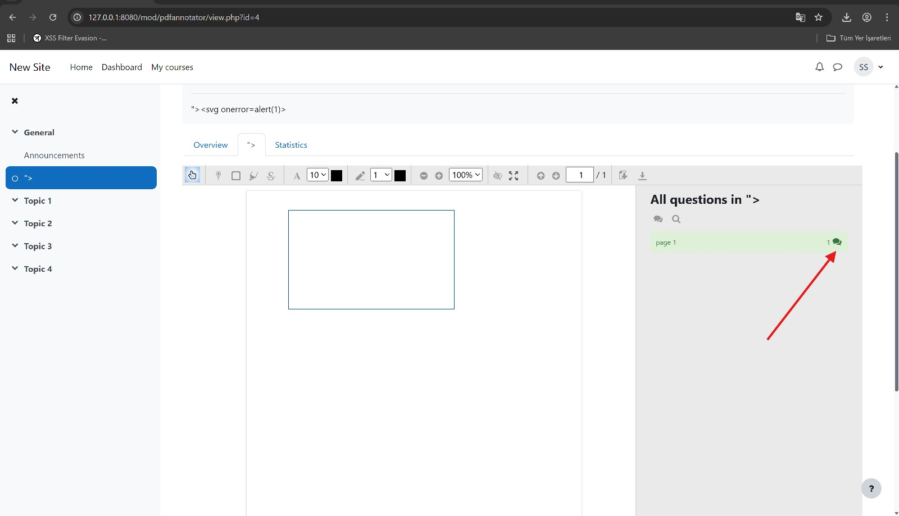

# CVE-2025-60506 | Stored Cross-Site Scripting (XSS) in Moodle PDF Annotator plugin (v1.5 release 9)

**Date:** 17-Oct-2025  
**Tags:** Cybersecurity, responsible-disclosure, penetration-testing

---

## Summary

- **Vulnerability:** Stored Cross-Site Scripting (XSS) in Moodle PDF Annotator plugin (`mod_pdfannotator`) — Public Comments rendering.  
- **CVE:** CVE-2025-60506 (assigned)  
- **Discoverer:** Onurcan Genç — Independent Security Researcher  
- **Tested environment:** Bitnami Docker image for Moodle 4.x  
- **Plugin:** `mod_pdfannotator` v1.5 (release 9, build `2025090300`)  
- **Browser used during testing:** Chrome (headless/visible)

---

## Vulnerability Summary

The **Public Comments** feature in the PDF Annotator plugin fails to properly sanitize user-supplied input before rendering it inside the PDF viewer’s comment panel. A low-privileged authenticated user (e.g., Student) can inject HTML/JavaScript into the Public Comments field; that content is stored and later executed in the browsers of other users (Student, Teacher, Admin) when they open the annotated PDF.

---

## Affected Component

- `/mod/pdfannotator/view.php`  
- `/mod/pdfannotator/ajax.php`

The vulnerable input is submitted via the **Add Public Comment** action; comments are loaded via AJAX and inserted into the PDF.js comment panel without adequate output encoding.

---

## Attack Scenario (high level)

1. **Attacker (Student)**: Adds a Public Comment containing unescaped HTML/JS to an annotated PDF activity.  
2. **Trigger**: Another user opens the same annotated PDF activity. The stored comment is inserted into the DOM of the PDF viewer and the browser executes it.  
3. **Result/Impact**: Stored XSS execution in victim’s browser — possible impacts include session theft, forced actions in the victim session, UI/UX manipulation, or further chain attacks depending on context.

> **Important (safety):** Publicly published PoC examples below use non-exfiltrative payloads (e.g., `alert()` or visible DOM markers). **Do not** publish or use payloads that exfiltrate cookies, credentials or other secrets in public artifacts.

---

## Technical Analysis (quick)

| Parameter | Value |
|---|---|
| Endpoint | `/mod/pdfannotator/ajax.php?action=save_comment` |
| Method | `POST` |
| Parameter | `content` |
| Affected role | Student (authenticated user) |
| Sanitization | Missing output escaping / direct insertion into DOM |
| Output context | Inserted into PDF.js comment panel (innerHTML-like behavior) |

**Illustrative request (do not publish real cookies):**

POST /mod/pdfannotator/ajax.php?action=save_comment&id=3 HTTP/1.1
Host: 127.0.0.1:8080
Content-Type: application/x-www-form-urlencoded
Cookie: MoodleSession=REDACTED

content=<script>alert('XSS-POC - CVE-2025-60506')</script>&userid=8&pdfid=5


**Expected server response example (JSON):**
```json
{"status":"success","message":"Comment saved successfully"}
```

**Proof of Concept**

Create activity with Moodle Admin or Teacher assigned with correlated course.


Select PDFAnnotator


As a student I initially placed a shape to apply comment. After that  vector to bypass JS tag ->

Click on comment part




Add any comment consisting  payload as below:


Create annotation refresh page and then switch to admin user.


As an admin user or teacher you can see the direct effect of Stored XSS via PDF handler.

